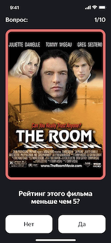
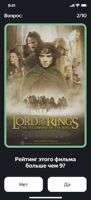
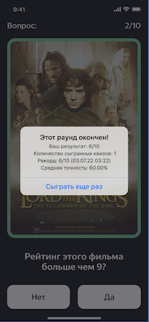
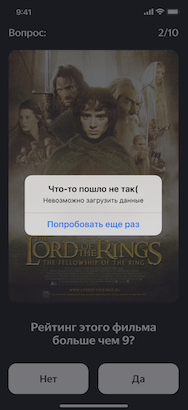

## MovieQuiz

MovieQuiz - одностраничное приложение с квизами о фильмах из топ-250 рейтинга IMDb. Информация о фильмах запрашивается через [API IMDb](https://imdb-api.com/api#Top250Movies-header). Пользователь приложения последовательно отвечает на вопросы о рейтинге фильмов. По итогам каждого раунда игры показывается статистика с количеством правильных ответов и лучших результатах пользователя. Цель игры - правильно ответить на все 10 вопросов раунда.   
**Технологии:** MVP, UIKit, Storyboard, DispatchQueue, UserDefaults, URLSession, JSONDecoder, Decodable, API IMDb, XCTest, unit tests, UI tests.

   

**ВНИМАНИЕ** ‼️ К сожалению, сервис imdb.com с июля 2023 года убрал возможность бесплатного тестового доступа к своему API. Теперь доступ к API IMDb только по платной подписке. По этой причине функциональность приложения ограничена. Для восстановления функциональности необходимо использовать актуальный API Key. Ключ задаётся по адресу /MovieQuiz/Resources/Constants.swift (константа apiKey).

## Ссылки

[Макет Figma](https://www.figma.com/file/l0IMG3Eys35fUrbvArtwsR/YP-Quiz?node-id=34%3A243)

[API IMDb](https://imdb-api.com/api#Top250Movies-header)

## Функциональные требования

- При запуске приложения показывается сплеш-скрин;
- После запуска приложения показывается экран вопроса с текстом вопроса, картинкой и двумя вариантами ответа, “да” и “нет”, только 1 из них правильный;
- Вопрос квиза составляется относительно IMDb рейтинга фильма по 10 бальной шкале, пример: "Рейтинг этого фильма больше 6?";
- Можно нажать на один из вариантов ответа на вопрос и получить отклик о том, правильный он или нет, при этом рамка фотографии поменяет цвет на соответствующий;
- После выбора ответа на вопрос через 1 секунду автоматически появляется следующий вопрос;
- После завершения раунда из 10 вопросов появляется поп-ап со статистикой пользователя. А именно - результат текущего раунда, количество праивильно отвеченных вопросов, поздравление, если отвечено на 10 из 10; 
- Пользователь может запустить новый раунд, нажав на кнопку "Сыграть еше раз".

## Технические требования 

- Приложение должно поддерживать устройства iPhone с iOS 13 или выше, предусмотрен только портретный режим. 

